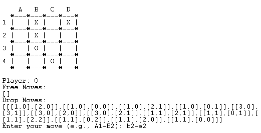
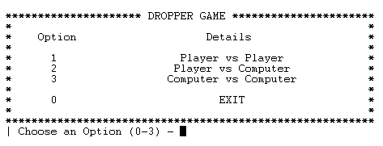

# Dropper Game

**Group Dropper_3:**
- Alexandre Guimarães Gomes Correia, up202007042
- Diogo Alexandre da Silva Santos, upXXXXXXXXX


## Installation and Execution

To run the game it is only necessary to open the SICStus Prolog interpreter and consult the file play.pl, then the game menu will open on the terminal and you can play the game.

## Description of the game

The Dropper is an abstract board game for two players. The game is typically played on a 8x8 board, but can be played on boards of different size, in our implementation it can be played on NxN boards.

- Player 'X' starts by placing one stone anywhere on the empty board.
- Player 'O', in their turn, has two moves to make:

    - **Drop Move:** This is where Player 'O' takes one of Player 'X's stones and replaces it with one of their own. They can do this by putting their stone in the place of Player 'X's stone and moving that player's stone to an empty spot adjacent to it, either diagonally or orthogonally.

    - **Free Move:** After the Drop move, Player 'O' gets to place their own stone in a free spot on the board. A free spot is one that doesn't have any stones adjacent to it in any direction, either diagonally or orthogonally.

Players continue taking turns, using the Drop-Free protocol, until they can no longer make Free moves. When Free moves are no longer possible, they proceed only with Drop moves. After all placement possibilities are exhausted, the game calculates the sizes of the stone groups for each player. A **group** is a set of stones of the same color that are orthogonally adjacent to each other. The player with the largest group wins. In case of a tie, the size of the second largest group is considered, and so on.

For more information about the game, you can check the official links about the game:

- https://andreachia.wordpress.com/2023/04/01/dropper/
- https://boardgamegeek.com/boardgame/384171/dropper

## Game Logic

### Internal Game State Representation

The game state is represented by a list the cointains the Board, the Player, the Valid Free moves and the valid Drop moves. The Board is a list of lists of characters. These characters can be an empty space, a 'X' for the case os black pieces and a 'O' for the case of white pieces. The Player is a character that can be 'X' or 'O' depending on the player that is playing. The Valid Free moves and the valid Drop moves are lists of lists of the corresponding moves. In the case of the Free move it is represented only by a list of coordinates of a spot on the board. In the case of the Drop move it is represented by a list of coordinates of the spot where the piece will be placed and the coordinates of the spot where the piece will be moved.

**Examples of games states:** <br>
(GameState = [Board, Player, FreeMoves, DropMoves])

- Initial game state:

````prolog
GameState = [ 
    % Board
    [[' ', ' ', ' ', ' '],
    [' ', ' ', ' ', ' '],
    [' ', ' ', ' ', ' '],
    [' ', ' ', ' ', ' ']],
    % Player
    'X',
    % FreeMoves
    [[0,0],[1,0],[2,0],[3,0],[0,1],[1,1],[2,1],[3,1],[0,2],[1,2],[2,2],[3,2],[0,3],[1,3],[2,3],[3,3]],
    % DropMoves
    []
]   
````
 - Mid-game game state:

````prolog
GameState = [
    % Board
    [[' ', 'X', ' ', 'X'],
    ['X', 'O', ' ', ' '],
    [' ', 'O', 'O', ' '],
    [' ', ' ', 'X', ' ']],
    % Player
    'O',
    % FreeMoves
    [],
    % DropMoves
    [[[1,0],[2,0]],[[1,0],[0,0]],[[1,0],[2,1]],[[3,0],[3,1]],[[3,0],[2,0]],[[3,0],[2,1]],[[0,1],[0,2]],[[0,1],[0,0]],[[2,3],[3,3]],[[2,3],[1,3]],[[2,3],[3,2]]]
]
````


### Game State Visualization
#### Game
The game state is visualized can be visualized by the predicate game_display/1. This predicate receives a game state and prints the board with the corresponding pieces and the valid moves for the current player.



To display the game state is used a predicate called display_board/1 that receives a board and prints it on the terminal. This predicate prints the first row with the references letters of the board, then it prints the actual board row by row with the the references numbers of the left side of the board. This prints are made using only *write/1* and *put_code/1* predicates.

#### Menu
The game menu is displayed by the *menu/0* predicate. This predicate prints the menu options and reads user input. Users have four options: playing against another player, playing against the computer having the option the choose its AI level, watching a computer vs. computer game with the choosen AI levels for each, and the last option to exit the game. It is recursively called until the user chooses the exit option.




### Move Validation and Execution

The inputs in the termninal are made character by character, when the user input the newline character the terminal stops reading the input. Then the game processes the input given and checks if it is according to the move format it is supose to be.

In case of a Free move the input must have 2 characters: the first one must be a letter (a-zA-Z) and the second one must be a number (1-9), **for example 'A2'**.

In case of a Drop move the input must have 5 characters: the first one must be a letter (a-zA-Z), the second one must be a number (1-9), the third one must be a the separator character '-', the fourth character must be letter (a-zA-Z) and the fifth one must be a number (1-9), **for example 'A2-B3'**.

The move input and validation is made by the predicates in the *inputs.pl* file.

After the move is validated it is executed by the predicate *move_free/3* or *move_drop/3*. This predicate receives the game state, the move to be executed and the new game state. This new game state will be used in the next game step. 

### List of Valid Moves

For each board the valid free moves and the valid drop moves are calculated and stored in the game state of that board. This lists of valid moves are used to detect if the player can make the move he input he desires or not.

To following predicates are used to get all the possible moves of the valid free moves and the valid drop moves:


````prolog
% valid_free_move(+Board, -Position).
valid_free_move(Board, [X, Y]) :-
    board_get_element(Board, [X, Y], Element),
    Element == ' ',
    board_get_adjacent(Board, [X, Y], ListOfAdjacent),
    check_all_spaces(ListOfAdjacent).
````

````prolog
% valid_drop_move(+Board, +Player, -Move).
valid_drop_move(Board, Player, [[X0, Y0], [X1, Y1]]) :-
    board_get_element(Board, [X0, Y0], Element),
    change_player(Player, Opponent),
    Element == Opponent,
    board_get_adjacent(Board, [X0, Y0], ListOfAdjacent),
    member([' ', [X1, Y1]], ListOfAdjacent).
````

The predicate *board_get_adjacent/3* receives a board and a position and returns a list of lists that have an element of the board and the corresponding position which is a list of two coordinates. For example, if the board is a 4x4 board and the position is [2,3] the list of adjacent elements will be the following:

````prolog
Board = [[' ', 'X', ' ', 'X'],
        ['X', 'O', ' ', ' '],
        [' ', 'O', 'O', ' '],
        [' ', ' ', 'X', ' ']]
Position = [2,3]
ListOfAdjacent = [[' ', [1,3]], ['O', [1,2]], ['O', [2,2]], [' ', [3,2]], [' ', [3,3]]]
````

The predicate *check_all_spaces/1* just receives a list of adjacent positions and checks if all the elements of those positions are empty spaces.

### End of Game

The end game is verified by the predicate *game_over/1*. This predicate receives a game state and checks if the game is over or not. The game is over when the player can't make any more moves, either Free or Drop moves. This predicate checks if the list of valid free moves and the list of valid drop moves are empty. If both lists are empty the game is over.

Therefore, if the game is over, the predicate *game_winner/2* is called. This predicate receives a game state and returns the winner of the game. The predicate calculates the sizes of the stone groups for each player and returns the player with the largest group.

This calculation is performed using a **flood-fill algorithm** on the board. The algorithm is implemented in the predicate *flood_fill/5*. This predicate takes as input a board, a position, a player, a list of visited positions, and the size of the group. The predicate checks if the position is valid, if it has not been visited, and if it matches the player's character. If all these conditions are true, the predicate calls itself recursively for all adjacent positions from the current position. The predicate also increments the size of the group for each valid position. The predicate stops when there are no more valid positions to visit, and the size of the group is returned in the last call of the predicate.


````prolog
% Flood-fill from a given position
% flood_fill(+Board, +X, +Y, +Piece, -Size)
flood_fill(Board, X, Y, Piece, Size) :-
    board_size(Board, N),
    valid_position(N, X, Y),
    \+ visited(X, Y),
    board_get_element(Board, [X, Y], Piece),
    asserta(visited(X, Y)),
    directions(Dirs),                   
    flood_fill_neighbours(Board, X, Y, Dirs, Piece, Sizes),
    sum_list(Sizes, NeighboursSize),
    Size is 1 + NeighboursSize.

flood_fill(_, _, _, _, 0).

% Flood-fill neighbouring cells
% flood_fill_neighbours(+Board, +X, +Y, +Dirs, +Piece, -Sizes)
flood_fill_neighbours(Board, X, Y, [DX-DY|RestDirs], Piece, [NeighbourSize|Sizes]) :-
    NewX is X + DX, NewY is Y + DY,
    flood_fill(Board, NewX, NewY, Piece, NeighbourSize),
    flood_fill_neighbours(Board, X, Y, RestDirs, Piece, Sizes).
flood_fill_neighbours(_, _, _, [], _, []).
````

This algorithm is executed for all possible positions on the board, creating a list of the sizes of all the groups for each player. Then, we determine the largest group and identify the player who possesses that group.


### Game State Evaluation

The evaluation of a game state is done by the predicate *value/3*, which receives a game state, a player, and returns the value of that specific game state. The calculation is performed by subtracting the size of the largest group of the player from the size of the largest group of the opponent. In the predicate, we take advantage of the already implemented flood-fill algorithm to determine the size of the largest group for each player.

````prolog
% value(+GameState, +Player, -Value)
value(GameState, Player, Value) :-
    GameState = [Board, _, _, _],
    largest_groups(Board, LargestX, LargestO),
    (Player == 'X' ->
        Value is LargestX - LargestO;
        Value is LargestO - LargestX
    ).
````

### Computer Plays

The game has implemented two levels of AI, as requested in the practical assignment.

The first level is random play, where the computer makes a random move from the list of valid moves. These moves are calculated by the *choose_move_level1/2* predicate.

The second level is greedy play, where the computer selects the move that results in the best outcome in the next game state. The best outcome is the one that leads to the largest group for the computer playing. These moves are calculated by the *choose_move_level2/2* predicate, which only makes a call to the *greedy_best_move/2* predicate.

In the greedy algorithm, after obtaining all possible game states and their corresponding values in a list, it sorts the list in descending order of value and filters it to include the top moves with the highest value. Then, it randomly selects a move from that list of best moves.

````prolog	
% valid_move(Board, Move), make_move(Board, Move, NewBoard)
greedy_best_move(GameState, Move) :-
    GameState = [Board, Player, FreeMoves, DropMoves],
    (FreeMoves == [] ->
        findall(Value-DropMove-[], (
            member(DropMove, DropMoves),
            value_move(GameState, DropMove-[], Value)
        ), ListOfMoves);
        (DropMoves \== [] -> 
            findall(Value-DropMove-FreeMove, (
                member(DropMove, DropMoves),
                member(FreeMove, FreeMoves),
                valid_move(GameState, DropMove-FreeMove),
                value_move(GameState, DropMove-FreeMove, Value)
            ), ListOfMoves);
            findall(Value-[]-FreeMove, (
                member(FreeMove, FreeMoves),
                value_move(GameState, []-FreeMove, Value)
            ), ListOfMoves)
        )
    ),
    sort(ListOfMoves, TempSortedMoves),
    reverse(TempSortedMoves, SortedList),
    nth0(0, SortedList, BestValue-_-_),
    findall(Value-DropMove-FreeMove, (
        member(Value-DropMove-FreeMove, SortedList), Value == BestValue
    ), BestMovesList),
    length(BestMovesList, N),
    random(0, N, Index),
    nth0(Index, BestMovesList, Move).
````


## Conclusions

The primary challenges were related to creating the flood-fill algorithm and handling input and movement validation. Implementing the flood-fill algorithm was particularly challenging due to the complexities of Prolog. Input validation posed difficulties as well, especially in reading and validating input character by character.

The method for inputting moves could be enhanced to achieve a more structured code for player vs. player interactions. Improving the game's terminal visualization would also enhance board readability and highlight valid moves.

However, it's worth noting that the game is fully playable, and the computer plays are working as intended.

## Bibliography

- https://andreachia.wordpress.com/2023/04/01/dropper/
- https://boardgamegeek.com/boardgame/384171/dropper
- https://chat.openai.com/
- https://en.wikipedia.org/wiki/Flood_fill
- https://sicstus.sics.se/sicstus/docs/latest4/pdf/sicstus.pdf
